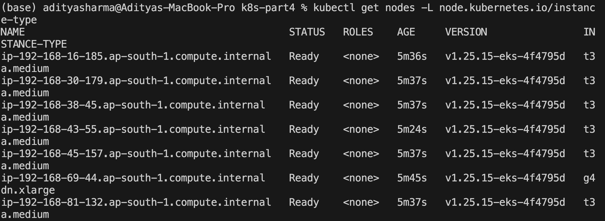
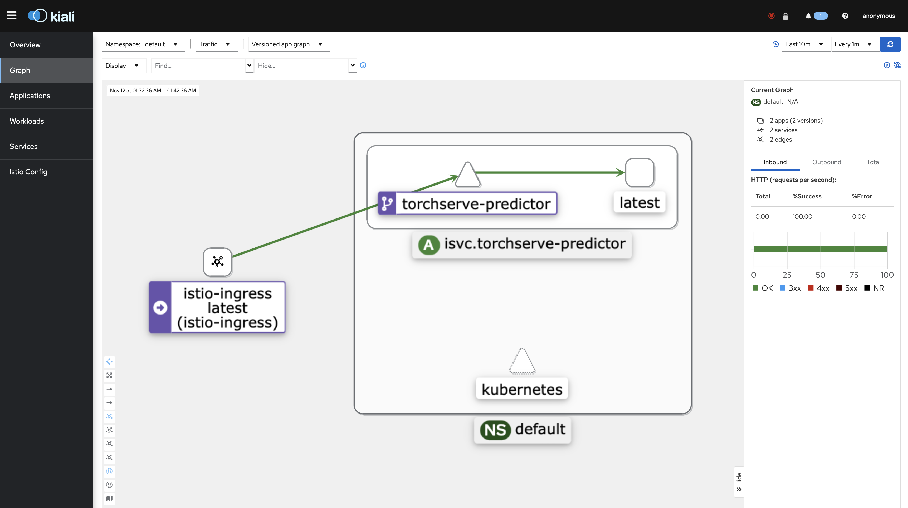
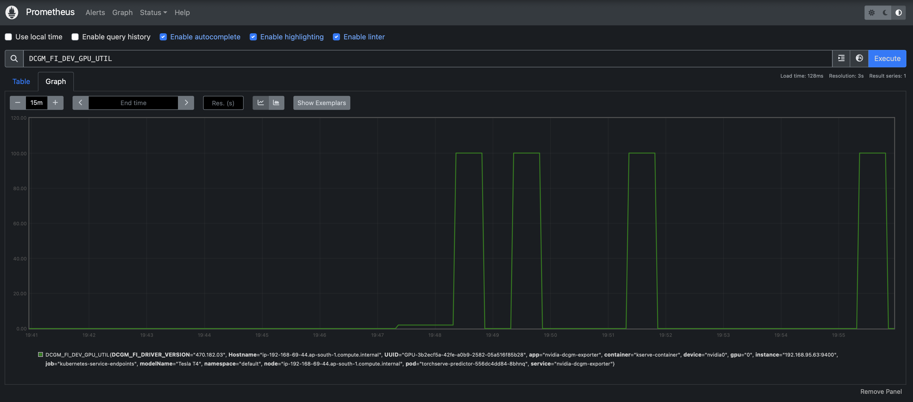

# Kubernetes - IV: Istio, KServe, and GPU Metrics

In this session, we deploy SDXL model on Kubernetes using KServe model serving framework with Istio. The application is exposed via a Load Balancer. The resulting deployment can be monitored for various parameters and can be visualized in tools like Kiali, Prometheus, and Grafana.

```bash
cd torchserve-mar
pip install -r requirements.txt 
python download_sdxl.py
bash model_zip.sh
```

```bash
# start a torchserve docker container to create the model archive file
docker run -it --rm --shm-size=1g --ulimit memlock=-1 --ulimit stack=67108864 --gpus all -v $(pwd):/opt/src pytorch/torchserve:0.8.1-gpu bash
```

```bash
# create MAR from handler and model artifact
cd /opt/src
torch-model-archiver --model-name sdxl --version 1.0 --handler sdxl_handler.py --extra-files sdxl-1.0-model.zip -r requirements.txt
```

> This will create sdxl.mar

```bash
# create a S3 Bucket where we will store these model .mar # files, which will be loaded by KServe
aws s3 cp config.properties s3://pytorch-models/config/
aws s3 cp sdxl.mar s3://pytorch-models/model-store/
```

## IAM S3 Policy

```bash
aws iam create-policy --policy-name S3ListTest --policy-document file://k8s-manifests/iam-s3-test-policy.json
# test policy is created
aws iam get-policy-version --policy-arn arn:aws:iam::ACCOUNT_ID:policy/S3ListTest --version-id v1
```

## Create Cluster

```bash
eksctl create cluster -f k8s-manifests/eks-cluster.yaml
```

## Enable IAM OIDC Provider

```bash
eksctl utils associate-iam-oidc-provider --region ap-south-1 --cluster basic-cluster --approve
```

## Create IAM Role for Service Account

```bash
eksctl create iamserviceaccount \
  --name s3-list-sa \
  --cluster basic-cluster \
  --attach-policy-arn arn:aws:iam::103877285477:policy/S3ListTest \
  --approve \
	--region ap-south-1
```

## Install Metrics API

```bash
kubectl apply -f https://github.com/kubernetes-sigs/metrics-server/releases/latest/download/components.yaml
```

## Istio Installation

```bash
helm repo add istio https://istio-release.storage.googleapis.com/charts

helm repo update
kubectl create namespace istio-system
helm install istio-base istio/base -n istio-system --set defaultRevision=default --wait
helm install istiod istio/istiod -n istio-system --wait
kubectl create namespace istio-ingress
```

```bash
helm install istio-ingress istio/gateway -n istio-ingress \
  --set "labels.istio=ingressgateway" \
  --set service.annotations."service\beta\.kubernetes\.io/aws-load-balancer-type"="nlb" \
  --set service.annotations."service\.beta\.kubernetes\.io/aws-load-balancer-scheme"="internet-facing" \
  --set service.annotations."service\.beta\.kubernetes\.io/aws-load-balancer-attributes"="load_balancing.cross_zone.enabled=true" \
  --wait

kubectl rollout restart deployment istio-ingress -n istio-ingress
```

### Enable Istio Side Car Injection

```bash
kubectl label namespace default istio-injection=enabled
```

## Install Addons: Prometheus, Grafana, Kiali

```bash
for ADDON in kiali jaeger prometheus grafana
do
    ADDON_URL="https://raw.githubusercontent.com/istio/istio/release-1.18/samples/addons/$ADDON.yaml"
    kubectl apply -f $ADDON_URL
done
```

## Install the Gateway CRDs

```bash
kubectl get crd gateways.gateway.networking.k8s.io &> /dev/null || \
  { kubectl kustomize "github.com/kubernetes-sigs/gateway-api/config/crd?ref=v0.8.0" | kubectl apply -f -; }
```  

## Setup GPU Metrics collection

### Remove NVIDIA device plugin

```bash
kubectl -n kube-system delete daemonset nvidia-device-plugin-daemonset
```

### Install NVIDIA GPU Operator

```bash
kubectl create namespace gpu-operator
curl https://raw.githubusercontent.com/NVIDIA/dcgm-exporter/main/etc/dcp-metrics-included.csv > dcgm-metrics.csv
kubectl create configmap metrics-config -n gpu-operator --from-file=dcgm-metrics.csv
helm repo add nvidia https://helm.ngc.nvidia.com/nvidia && helm repo update

helm install --wait \
	--generate-name -n gpu-operator \
	--create-namespace nvidia/gpu-operator \
	--set "dcgmExporter.config.name"=metrics-config \
	--set "dcgmExporter.env[0].name"=DCGM_EXPORTER_COLLECTORS \
	--set "dcgmExporter.env[0].value"=/etc/dcgm-exporter/dcgm-metrics.csv \
	--set toolkit.enabled=false
```

```bash
kubectl -n gpu-operator logs -f $(kubectl -n gpu-operator get pods | grep dcgm | cut -d ' ' -f 1 | head -n 1)
```
### Modify Prometheus to collect logs from DGCA (lines added and the resulting file is already present in repo)

```bash
curl https://raw.githubusercontent.com/istio/istio/release-1.18/samples/addons/prometheus.yaml

kubectl apply -f k8s-manifests/prometheus.yaml
```

## Install KServe

### Istio Ingress Class

```bash
kubectl apply -f k8s-manifests/istio-kserve-ingress.yaml   
```

### Install Cert Manager

```bash
kubectl apply -f https://github.com/cert-manager/cert-manager/releases/download/v1.13.1/cert-manager.yaml
```

### Install KServe Manifest

```bash
kubectl apply -f https://github.com/kserve/kserve/releases/download/v0.11.1/kserve.yaml
```

### Install KServe Runtime

```bash
kubectl apply -f https://github.com/kserve/kserve/releases/download/v0.11.1/kserve-runtimes.yaml

kubectl patch configmap/inferenceservice-config -n kserve --type=strategic -p '{"data": {"deploy": "{\"defaultDeploymentMode\": \"RawDeployment\"}"}}'
```

### Secret for S3 Access by KServe

```bash 
eksctl create iamserviceaccount \
	--cluster=basic-cluster \
	--name=s3-read-only \
	--attach-policy-arn=arn:aws:iam::aws:policy/AmazonS3ReadOnlyAccess \
	--override-existing-serviceaccounts \
	--region ap-south-1 \
	--approve
```    

```bash
kubectl apply -f k8s-manifests/kserve-s3-secret.yaml

kubectl patch serviceaccount s3-read-only -p '{"secrets": [{"name": "s3-secret"}]}'
```

## Deploy SDXL on KServe

```bash
kubectl apply -f k8s-manifests/sdxl-kserve.yaml

kubectl get pods
kubectl logs torchserve-predictor-556dc4dd84-8bhnq 
```

### Test the deployment

```bash
export INGRESS_HOST=$(kubectl -n istio-ingress get service istio-ingress -o jsonpath='{.status.loadBalancer.ingress[0].hostname}')

export INGRESS_PORT=$(kubectl -n istio-ingress get service istio-ingress -o jsonpath='{.spec.ports[?(@.name=="http2")].port}')
export MODEL_NAME=sdxl
export SERVICE_HOSTNAME=$(kubectl get inferenceservice torchserve -o jsonpath='{.status.url}' | cut -d "/" -f 3)
```

```bash
python test_sdxl_kserve.py
```

## SDXL Inference Results


## Dashboards

### EKS Cluster Nodes



### Kiali KServe Graph



### GPU Utilization on Prometheus



## Demo of Grafana and Kiali

### Grafana Dashboard 

[](https://youtu.be/14l0vqI1uSg)

### KServe Graph on Kiali 

[](https://youtu.be/a_V2uxH0oYE)


